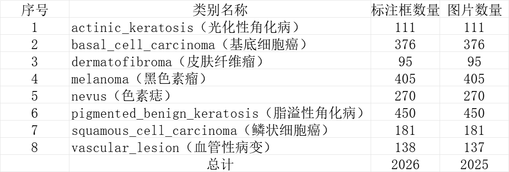
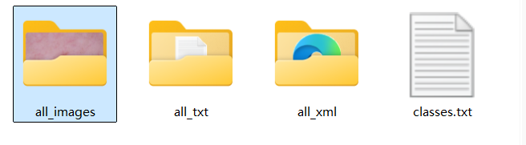
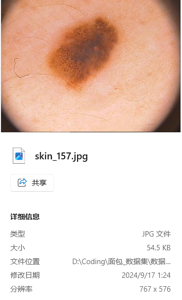
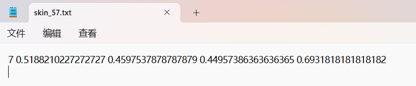
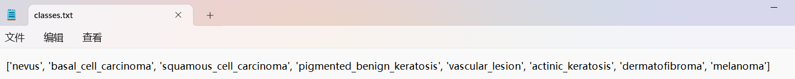
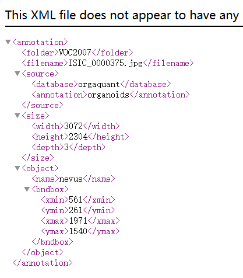
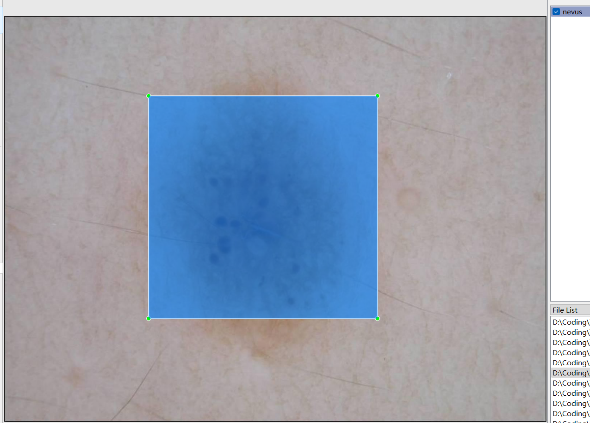

# Dermatology Detection - Target Detection Dataset

Dataset Information: The dataset consists of 2025 images and corresponding ground-truth files.
The ground-truth files are available in two formats: VOC-XML files and YOLO-txt files.
There are several objects to be detected, including:
['nevus', 'basalcellcarcinoma', 'squamouscellcarcinoma', 'pigmented_benign_keratosis', 'vascular_lesion', 'actinic_keratosis', 'dermatofibroma', 'melanoma']
The number of bounding box information is as follows: (the English labels are used for marking, and the Chinese names provided in parentheses are for reference)
Note: A single image may contain multiple objects, so the total number of bounding boxes may be greater than the number of images.
The complete dataset includes three folders and one text file:
all_images: Stores the dataset's images, screenshots included.
Image size information:
all_txt and classes.txt: Store the YOLO-txt ground-truth files, with the same number of files as the images, each ground-truth file corresponds to an image.
classes.txt:
For a detailed understanding of the YOLO-txt standard file, please refer to your own internet search. In short, index 0 represents the name of the object at index 0 in the array in classes.txt.
all_xml: VOC-XML ground-truth files.
The number of these files is the same as the images, each ground-truth file corresponds to an image.
For a detailed understanding of the VOC-XML standard file, please refer to your own internet search.
Both formats of ground-truth can be used, choose one according to your preference.
Ground-truth effect screenshot:

Image

Here is a pay link on Stripe ( https://buy.stripe.com/3cs8yP7sY87d0vu9AB ). Please contact me lonlonago@foxmail.com after funding $89, and I will send you a complete data files , thank you!

